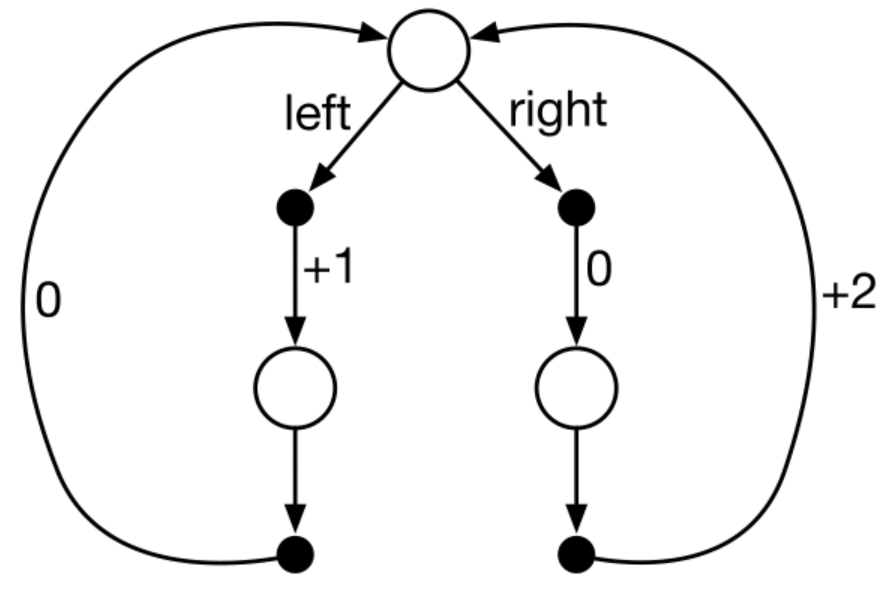

```{r, code = readLines("setup.R"), cache = FALSE, include=FALSE}
```

```{r}
knitr::opts_chunk$set(
   echo = TRUE
)
```


# Policies and value functions for MDPs {#mod-mdp-2}

This module go deeper in the theory of finite Markov decision processes (MDPs). The concept of a policy and value functions is considered. Once the problem is formulated as an MDP, finding the optimal policy can be found using value functions. 

## Learning outcomes 

By the end of this module, you are expected to:

<!-- * Identify the different elements of a Markov Decision Processes (MDP). -->
<!-- * Describe how the dynamics of an MDP are defined. -->
<!-- * Understand how the agent-environment RL description relates to an MDP. -->
<!-- * Interpret the graphical representation of a Markov Decision Process. -->
<!-- * Describe how rewards are used to define the objective function (expected return). -->
<!-- * Interpret the discount factor and its effect on the objective function. -->
<!-- * Identify episodes and how to formulate an MDP by adding an absorbing state.  -->

* Identify a policy as a distribution over actions for each possible state.
* Define value functions for a state and action. 
* Derive the Bellman equation for a value function.
* Understand how Bellman equations relate current and future values.
* Define an optimal policy.
* Derive the Bellman optimality equation for a value function.

The learning outcomes relate to the [overall learning goals](#mod-lg-course) number 2, 7, 10, and 12 of the course.

<!-- SOLO increasing: identify · memorise · name · do simple procedure · collect data · -->
<!-- enumerate · describe · interpret · formulate · list · paraphrase · combine · do -->
<!-- algorithms · compare · contrast · explain causes · analyse · relate · derive · -->
<!-- evaluate · apply · argue · theorise · generalise · hypothesise · solve · reflect -->


## Textbook readings

For this week, you will need to read Chapter 3.5-3.7 in @Sutton18. Read it before continuing this module. You do not have to put to much focus on the examples. A summary of the book notation can be seen [here][sutton-notation].

```{r, echo=FALSE}
link_slide_file_text("04", "mdp-2")
```

## Policies and value functions

A *policy* $\pi$ is a distribution over actions, given some state:

$$\pi(a | s) = \Pr(A_t = a | S_t = s).$$
Since the MDP is stationary the policy is time-independent, i.e. given a state, we choose the same action no matter the time-step. If $\pi(a | s) = 1$ for a single state, i.e. an action is chosen with probability one always then the policy is called *deterministic*. Otherwise a policy is called *stochastic*.

Given a policy we can define some value functions. The *state-value function* $v_\pi(s)$ denote the expected return starting from state $s$ when following the policy $\pi$:

$$
\begin{align}
  v_\pi(s) &= \mathbb{E}_\pi[G_t | S_t = s] \\
  &= \mathbb{E}_\pi[R_{t+1} + \gamma G_{t+1} | S_t = s].
\end{align}
$$
Note the last equal sign comes from $G_t = R_{t+1} + \gamma G_{t+1}$.

The *action-value function* $q_\pi(s, a)$, denote the expected return starting from state $s$, taking action $a$ and from thereon following policy $\pi$:

$$
\begin{align}
  q_\pi(s, a) &= \mathbb{E}_\pi[G_t | S_t = s, A_t = a] \\
  &= \mathbb{E}_\pi[R_{t+1} + \gamma G_{t+1} | S_t = s, A_t = a].
\end{align}
$$

This action-value, also known as "q-value", is very important, as it tells us directly what action to pick in a particular state. Given the definition of q-values, the state-value function is an average over the q-values of all actions we could take in that state:

\begin{equation}
v_\pi(s) = \sum_{a \in \mathcal{A}}\pi(a|s)q_\pi(s, a)
(\#eq:vq)
\end{equation}

A q-value (action-value) is equal to the expected reward $r(s,a)$ that we get from choosing action $a$ in state $s$, plus a discounted amount of the average state-value of all the future states:

$$q_\pi(s, a) = r(s,a) + \gamma\sum_{s' \in \mathcal{S}} p(s' | s, a) v_\pi(s')$$

Joining the equations, the state-value of a particular state $s$ now becomes the sum of weighted state-values of all possible
subsequent states $s'$, where the weights are the policy probabilities:

$$
\begin{align}
  v_\pi(s) &= \sum_{a \in \mathcal{A}}\pi(a | s)q_\pi(s, a) \\
  &= \sum_{a \in \mathcal{A}}\pi(a | s)\left( r(s,a) + \gamma\sum_{s' \in \mathcal{S}} p(s' | s, a) v_\pi(s')\right),
\end{align}
(\#eq:bell-state)
$$
which is known as the *Bellman equation*.
<!-- in exactly the same way we can define a q-value as a weighted sum of the -->
<!-- q-values of all states we could reach given we pick the action of the q-value: -->

<!-- $$ -->
<!-- \begin{align} -->
<!-- q_\pi(s, a) &= \mathcal{R}_s^a + \gamma\sum_{s' \in \mathcal{S}} P_{ss'}^a v_\pi(s') \\ -->
<!-- &= \mathcal{R}_s^a + \gamma \sum_{s' \in \mathcal{S}} \mathcal{P}_{ss'}^a \sum_{a' \in \mathcal{A}} \pi(a'|s')q_\pi(s',a') -->
<!-- \end{align} -->
<!-- $$ -->


## Optimal policies and value functions {#sec-mdp-opt}

The objective function of an MDP can now be stated mathematically which is to find an optimal policy $\pi_*$ with state-value function:

$$v_*(s) = \max_\pi v_\pi(s).$$
That is, a policy $\pi'$ is defined as better than policy $\pi$ if its expected return is higher for all states. Note the objective function is not a scalar here but if the agent start in state $s_0$ then we may reformulate the objective function maximize the expected return to $$v_*(s_0) = \max_\pi \mathbb{E}_\pi[G_0 | S_0 = s_0] = \max_\pi v_\pi(s_0)$$

If the MDP has the right properties (details are not given here), there exists an optimal deterministic policy $\pi_*$ which is better than or just as good as all other policies. For all such optimal policies (there may be more than one), we only need to find one optimal policy that have the *optimal state-value function* \(v_*\). 

We may rewrite $v_*(s)$ using Eq. \@ref(eq:vq):
$$
\begin{align}
  v_*(s) &= \max_\pi v_\pi(s) \\
         &= \max_\pi \sum_{a \in \mathcal{A}}\pi(a|s)q_\pi(s, a) \\
         &= \max_\pi \max_a q_\pi(s, a)\qquad \text{(set $\pi(a|s) = 1$ where $q_\pi$ is maximal)} \\
         &= \max_a \max_\pi q_\pi(s, a) \\
         &= \max_a q_*(s, a), \\
\end{align}
$$
where the *optimal q-value/action-value function* \(q_*\) is:

$$
\begin{align}
q_*(s, a) &= \max_\pi q_\pi(s, a) \\
          &= r(s,a) + \gamma\sum_{s' \in \mathcal{S}} p(s' | s, a) v_*(s') \\
          &= r(s,a) + \gamma\sum_{s' \in \mathcal{S}} p(s' | s, a) \max_{a'} q_*(s', a').
\end{align}
$$
This is the the *Bellman optimality equation* for $q_*$ and the optimal policy is:

$$
\pi_*(a | s) =
\begin{cases}
1 \text{ if } a = \arg\max_{a \in \mathcal{A}} q_*(s, a) \\
0 \text { otherwise.}
\end{cases}
$$
Or we may define a deterministic policy as 
$$
\begin{align}
\pi_*(s) &= \arg\max_{a \in \mathcal{A}} q_*(s, a) \\
         &= \arg\max_{a \in \mathcal{A}} \left(r(s,a) + \gamma\sum_{s' \in \mathcal{S}} p(s' | s, a) v_*(s')\right).
\end{align}
(\#eq:bell-opt-state-policy)
$$


Similar we can write the *Bellman optimality equation* for $v_*$:

$$
\begin{align}
  v_*(s) &= \max_a q_*(s, a) \\
         &= \max_a r(s,a) + \gamma\sum_{s' \in \mathcal{S}} p(s' | s, a) v_*(s')
\end{align}
(\#eq:bell-opt-state)
$$

Note the Bellman equations define our state-value and q-value function, while the Bellman optimality equations define how to find the optimal
value functions. Using \(v_*\), the optimal expected long term return is turned into a quantity that is immediately available for each state. On the other hand if we do not store $v_*$, we can find $v_*$ by a one-step-ahead search using $q_*$, acting greedy.


## Optimality vs approximation 

In Section \@ref(sec-mdp-opt) optimal policies and value functions was found; however solving the Bellman optimality equations can be expensive, e.g. if the number of states is huge. Consider a state $s = (x_1,\ldots,x_n)$ with state variables $x_i$ each taking two possible values, then the number of states is $|\mathcal{S}| = 2^n$. That is, the state space grows exponentially with the number of state variables also known as the *curse of dimensionality*. 

Large state or action spaces may happen in practice; moreover, they may also be continuous. As a result we need to approximate the value functions because calculation of optimality is too expensive. This is indeed what happens in RL where we approximate the expected return. Furthermore, often we focus on states with high encountering probability while allowing the agent to make sub-optimal decisions in states that have a low probability. 


<!-- \subsection{Key Takeaways} -->
<!-- \begin{itemize} -->
<!-- \item We summarise our goal for the agent as a \textit{reward}; its objective is to maximise the cumulative sum of future rewards -->
<!-- \item For episodic tasks, returns terminate (and are backpropogated) when the episode ends. For the continuous control case, returns are discounted so they do not run to infinity.  -->
<!-- \item A state signal that succeeds in retaining all relevant information about the past is \textit{Markov}.  -->
<!-- \item Markov Decision Processes (MDPs) are the mathematically idealised version of the RL problem. They have system dynamics: $p(s', r | s, a) = Pr \{R_{r+1} = r, S_{t+1} = s' | S_t, A_t\}$ -->
<!-- \item Policies are a (probabilistic) mapping from states to actions. -->
<!-- \item Value functions estimate how good it is for an agent to be in a state ($v_\pi$) or to take an action from a state ($q_\pi$). They are always defined w.r.t policies as the value of a state depends on the policy one takes in that state. Value functions are the \textit{expected cumulative sum of future rewards} from a state or state-action pair. -->
<!-- \item Knowing our policy and system dynamics, we can define the state value function is defined by the Bellman equation: $v_\pi(s) = \sum_{a} \pi(a|s) \sum_{s',r} p(s', r | s, a) \left[r + \gamma v_\pi(s')\right]$ -->
<!-- \item An optimal policy ($\pi_*$) is the policy that maximises expected cumulative reward from all states. From the optimal policy we can derive the optimal value functions $q_*$ and $v_*$. -->
<!-- \end{itemize} -->


## Semi-MDPs (non-fixed time length)

So far we have considered MDPs with a fixed length between each time-step. The model can be extended to MDPs with non-fixed time-lengths known as semi-MDPs. Let $l(s'|s,a)$ denote the length of a time-step given that the system is in state $s$, action $a$ is chosen and makes a transition to state $s'$. Then the discount rate over a time-step with length $l(s'|s,a)$ is then

$$\gamma(s'|s,a) = \gamma^{l(s'|s,a)},$$ 

and the Bellman optimality equations becomes:

$$
v_*(s) = \max_a r(s,a) + \sum_{s' \in \mathcal{S}} p(s' | s, a) \gamma(s'|s,a)  v_*(s'),
$$

and
$$
q_*(s, a) = r(s,a) + \sum_{s' \in \mathcal{S}} p(s' | s, a) \gamma(s'|s,a) \max_{a'} q_*(s', a').
$$

That is, the discount rate now is a part of the sum since it depends on the length which depends on the transition. 


## Summary 

Read Chapter 3.8 in @Sutton18.


## Exercises {#sec-mdp-2-ex}


### Exercise - Optimal policy {#ex-mdp-2-policy}

```{r simple, echo=FALSE,fig.cap="A simple MDP.", out.width="400px"}

```


Consider the transition diagram for an MDP shown in Figure \@ref(fig:simple) with 3 states (white circles). The only decision to be made is that in the top state $s$, where two actions are available, left and right. The numbers show the rewards that are received deterministically after each action. There are exactly two deterministic policies *left* and *right*. Which policy is optimal if $\gamma = 0, 0.9$ and $0.5$?

<!-- Let $\pi_L$ and $\pi_R$ denote the left and right policy, respectively. Recall the Bellman equation: $$v_\pi(s) = \sum_{a \in \mathcal{A}}\pi(a | s)\left( r(s,a) + \gamma\sum_{s' \in \mathcal{S}} p(s' | s, a) v_\pi(s')\right).$$ For the left policy this reduces to $$v_{\pi_L}(s) = 1 + \gamma(v_\pi(s')) = 1 + \gamma(0 + \gamma v_{\pi_L}(s)).$$ Isolating $v_{\pi_L}(s)$ gives us $$v_{\pi_L}(s) = 1/(1-\gamma^2).$$ Similar for the right policy we get $$v_{\pi_R}(s) = 0 + \gamma(v_\pi(s')) = 0 + \gamma(2 + \gamma v_{\pi_R}(s)).$$ Isolating $v_{\pi_R}(s)$ gives us $$v_{\pi_R}(s) = 2\gamma/(1-\gamma^2).$$ Now  -->

<!-- * for $\gamma=0$ we get $v_{\pi_L}(s) = 1$ and $v_{\pi_R}(s) = 0$, i.e. left policy optimal. -->
<!-- * for $\gamma=0.9$ we get $v_{\pi_L}(s) = 5.26$ and $v_{\pi_R}(s) = 9.47$, i.e. right policy optimal. -->
<!-- * for $\gamma=0.5$ we get $v_{\pi_L}(s) = 1.33$ and $v_{\pi_R}(s) = 1.33$, i.e. both policies optimal. -->


### Exercise - Car rental {#ex-mdp-2-car}

Consider a rental company with two locations, each with a capacity of 20 cars. Each day, customers arrive at each location to rent cars. If a car is available, it is rented out with a reward of $10. Otherwise the opportunity is lost. Cars become available for renting the day after they are returned. 

The number of cars rental requests $D_i$ at Location $i=1,2$ are Poisson distributed with mean 3 and 4. Similar, the number of cars returned $H_i$ at Location $i=1,2$ are Poisson distributed with mean 3 and 2. Cars returned resulting in more cars than the capacity are lost (and thus disappear from the problem). 

To ensure that cars are available where they are needed, they can be moved between the two locations overnight, at a cost of $2 per car. A maximum of five cars can be moved from one location to the other in one night. 

Formulate the problem as an finite MDP where the time-steps are days.

<!-- Q1 -->


   1) Define the state space (with states $(x,y)$) equal the number of cars at each location at the end of the day.
   
<!-- Q2 -->


   2) Define the action space equal the net numbers of cars moved from Location 1 to Location 2 overnight, i.e. negative if move from Location 2 to 1. 
   
<!-- Q3 -->


   3) Calculate the expected reward $r(s,a)$.
   
Note the inventory dynamics (number of cars) at each parking lot is independent of the other given an action $a$. Let us consider Location 1 and assume that we are in state $x$ and chose action $a$. Then the number of cars after movement is $x - a$ and after rental requests $x - a - \min(D_1, x-a)$. Next, the number of returned cars are added: $x - a - \min(D_1, x-a) +  H_1$. Finally, note that if this number is above 20 (parking lot capacity), then we only have 20 cars, i.e. the inventory dynamics (number of cars at the end of the day) is $$X = \min(20,  x-a - \min(D_1, x-a) +  H_1))).$$

<!-- Q4 -->


   4) Give the inventory dynamics for Location 2.


