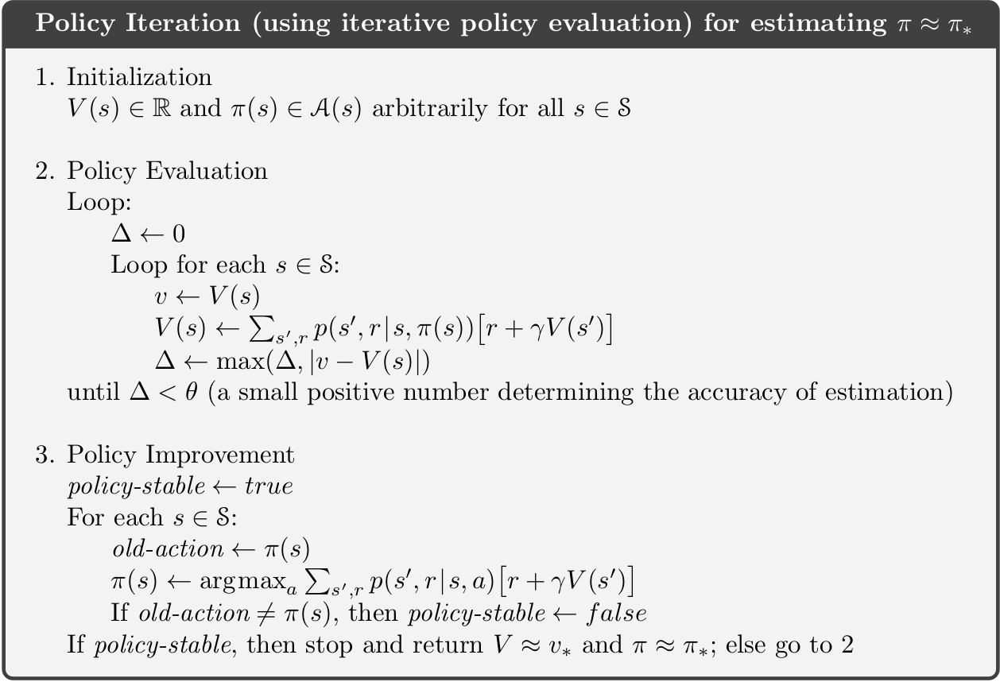
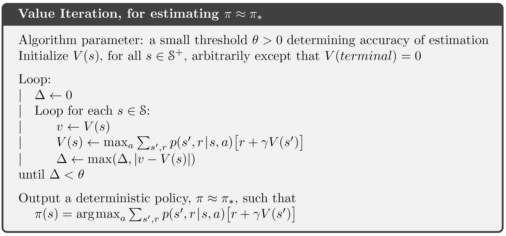

```{r, code = readLines("setup.R"), cache = FALSE, include=FALSE}
```

```{r}
knitr::opts_chunk$set(
   echo = TRUE
)
```


# Dynamic programming {#mod-dp}

The term *Dynamic Programming* (*DP*) refers to a collection of algorithms that can be used to compute optimal policies of a model with full information about the dynamics, e.g. a Markov Decision Process (MDP). A DP model must satisfy the *principle of optimality*. That is, an optimal policy must consist for optimal sub-polices or alternatively the optimal value function in a state can be calculated using optimal value functions in future states. This is indeed what is described with the Bellman optimality equations. 

DP do both *policy evaluation* (prediction) and *control*. Policy evaluation give us the value function $v_\pi$ given a policy $\pi$. Control refer to finding the best policy or optimizing the value function. This can be done using the Bellman optimality equations.

Two main problems arise with DP. First, often we do not have full information about the MDP model, e.g. the rewards or transition probabilities are unknown. Second, we need to calculate the value function in all states using the rewards, actions, and transition probabilities. Hence, using DP may be computationally expensive if we have a large number of states and actions.

Note the term programming in DP have nothing to do with a computer program but comes from that the mathematical model is called a "program". 


## Learning outcomes 

By the end of this module, you are expected to:

* Describe the distinction between policy evaluation and control.
* Identify when DP can be applied, as well as its limitations.
* Explain and apply iterative policy evaluation for estimating state-values given a policy.
* Interpret the policy improvement theorem.
* Explain and apply policy iteration for finding an optimal policy.
* Explain and apply value iteration for finding an optimal policy.
* Describe the ideas behind generalized policy iteration.
* Interpret the distinction between synchronous and asynchronous dynamic programming methods.

The learning outcomes relate to the [overall learning goals](#mod-lg-course) number 2, 4, 6, 7, 8, 10 and 12 of the course.

<!-- SOLO increasing: identify · memorise · name · do simple procedure · collect data · -->
<!-- enumerate · describe · interpret · formulate · list · paraphrase · combine · do -->
<!-- algorithms · compare · contrast · explain causes · analyse · relate · derive · -->
<!-- evaluate · apply · argue · theorise · generalise · hypothesise · solve · reflect -->


## Textbook readings

For this week, you will need to read Chapter 4-4.7 in @Sutton18. Read it before continuing this module. A summary of the book notation can be seen [here](sutton-notation).


## Policy evaluation {#sec-dp-pe}

The state-value function can be represented using the Bellman equation \@ref(eq:bell-state):
\begin{equation}
v_\pi(s) = \sum_{a \in \mathcal{A}}\pi(a | s)\left( r(s,a) + \gamma\sum_{s' \in \mathcal{S}} p(s' | s, a) v_\pi(s')\right).            
\end{equation}

If the dynamics are known perfectly, this becomes a system of $|\mathcal{S}|$ simultaneous linear equations in $|\mathcal{S}|$ unknowns $v_\pi(s), s \in \mathcal{S}$. This linear system can be solved using e.g. some software. However, inverting the matrix can be computationally expensive for a large state space. Instead we consider an iterative method and a sequence of value function approximations $v_0, v_1, v_2, \ldots$, with initial approximation $v_0$ chosen arbitrarily e.g. $v_0(s) = 0 \:  \forall s$ (ensuring terminal state = 0). We can use *a sweep* with the Bellman equation to update the values:

\begin{equation}
v_{k+1}(s) = \sum_{a \in \mathcal{A}}\pi(a | s)\left( r(s,a) + \gamma\sum_{s' \in \mathcal{S}} p(s' | s, a) v_k(s')\right) 
\end{equation}

We call this update an *expected update* because it is based on the expectation over all possible next states, rather than a sample of reward from the next state. This update will converge to $v_\pi$ after a number of sweeps of the state-space. Since we do not want an infinite number of sweeps we introduce a threshold $\theta$ (see Figure \@ref(fig:policy-eval-alg)). Note the algorithm uses two arrays to maintain the state-value ($v$ and $V$). Alternatively, a single array could be used that update values in place, i.e. $V$ is used in place of $v$. Hence, state-values are updated faster. 

```{r policy-eval-alg, echo=FALSE, fig.cap="Iterative policy evaluation [@Sutton18]."}
knitr::include_graphics("img/policy-evalution.png")
```


## Policy Improvement

From the Bellman optimality equation \@ref(eq:bell-opt-state) we have 

$$
\begin{align}
\pi_*(s) &= \arg\max_{a \in \mathcal{A}} q_*(s, a) \\
         &= \arg\max_{a \in \mathcal{A}} \left(r(s,a) + \gamma\sum_{s' \in \mathcal{S}} p(s' | s, a) v_*(s')\right).
\end{align}
(\#eq:pi-det)
$$
That is, a deterministic optimal policy can be found by choosing *greedy* the best action given the optimal value function. If we apply this greed action selection to the value function for a policy $\pi$ and pick the action with most $q$:
$$
\begin{align}
\pi'(s) &= \arg\max_{a \in \mathcal{A}} q_\pi(s, a) \\
         &= \arg\max_{a \in \mathcal{A}} \left(r(s,a) + \gamma\sum_{s' \in \mathcal{S}} p(s' | s, a) v_\pi(s')\right),
\end{align}
(\#eq:pi-mark-det)
$$
then 
$$
q_\pi(s, \pi'(s)) \geq q_\pi(s, \pi(s)) = v_\pi(s) \quad \forall s \in \mathcal{S}.
$$
Note if $\pi'(s) = \pi(s), \forall s\in\mathcal{S}$ then the Bellman optimality equation \@ref(eq:bell-opt-state) holds and $\pi$ must be optimal; Otherwise, 
$$
\begin{align}
  v_\pi(s) &\leq q_\pi(s, \pi'(s)) = \mathbb{E}_{\pi'}[R_{t+1} + \gamma v_\pi(S_{t+1}) | S_t = s] \\
&\leq \mathbb{E}_{\pi'}[R_{t+1} + \gamma q_\pi(S_{t+1}, \pi'(S_{t+1})) | S_t = s] \\
&\leq \mathbb{E}_{\pi'}[R_{t+1} + \gamma (R_{t+2} + \gamma^2 v_\pi(S_{t+2})) | S_t = s] \\
&\leq \mathbb{E}_{\pi'}[R_{t+1} + \gamma R_{t+2} + \gamma^2 q_\pi(S_{t+2}, \pi'(S_{t+2})) | S_t = s] \\
&\leq \mathbb{E}_{\pi'}[R_{t+1} + \gamma R_{t+2} + \gamma^2 R_{t+3} + ...)) | S_t = s] \\
&= v_{\pi'}(s),
\end{align}
$$
That is, policy $\pi'$ is strictly better than policy $\pi$ since there is at least one state $s$ for which $v_{\pi'}(s) > v_\pi(s)$. We can formalize the above deductions in a theorem.

::: {.theorem name="Policy improvement theorem"}
Let $\pi$, $\pi'$ be any pair of deterministic policies, such that
\begin{equation}
    q_\pi(s, \pi'(s)) \geq v_\pi(s) \quad \forall s \in \mathcal{S}.
\end{equation}
That is, $\pi'$ is as least as good as $\pi$.
:::


## Policy Iteration

Given the policy improvement theorem we can now improve policies iteratively until we find an optimal policy: 

1. Pick an arbitrary initial policy $\pi$.
2. Given a policy $\pi$, estimate $v_\pi(s)$ via the policy evaluation algorithm.
3. Generate a new, improved policy $\pi' \geq \pi$ by *greedily* picking $\pi' = \text{greedy}(v_\pi)$ using Equation \@ref(eq:pi-mark-det). If $\pi'=\pi$ then stop ($\pi_*$ has been found); otherwise go to Step 2.

The algorithm is given in Figure \@ref(fig:policy-ite-alg). The sequence of calculations will be: 
$$\pi_0 \xrightarrow[]{E} v_{\pi_0} \xrightarrow[]{I} \pi_1 \xrightarrow[]{E} v_{\pi_1} \xrightarrow[]{I} \pi_2 \xrightarrow[]{E} v_{\pi_2}  \ldots \xrightarrow[]{I} \pi_* \xrightarrow[]{E} v_{*}$$
The number of steps of policy iteration needed to find the optimal policy are often low.

```{r policy-ite-alg, echo=FALSE, fig.cap="Policy iteration [@Sutton18].", out.width="70%"}

``` 


## Value Iteration

Policy iteration requires full policy evaluation at each iteration step. This could be an computationally expensive process which requires may sweeps of the state space. In *value iteration*, the policy evaluation is stopped after one sweep of the state space. Value iteration is achieved by turning the Bellman optimality equation into an update rule:
$$
v_{k+1}(s) = \arg\max_a \left(r(s,a) + \gamma\sum_{s',r} p(s'|s, a)v_k(s')\right)
$$
Value iteration effectively combines, in each of its sweeps, one sweep of policy evaluation and one sweep of policy improvement, since it performs a greedy update while also evaluating the current policy. Also, it is important to understand that the value-iteration algorithm does not require a policy to work. No actions have to be chosen. Rather, the state-values are updated and after the last step of value-iteration the optimal policy $\pi_*$ is found:

$$
\pi_*(s) = \arg\max_{a \in \mathcal{A}} \left(r(s,a) + \gamma\sum_{s' \in \mathcal{S}} p(s' | s, a) v_*(s')\right),
$$
The algorithm is given in Figure \@ref(fig:value-ite-alg). Since we do not want an infinite number of iterations we introduce a threshold $\theta$. The sequence of calculations will be (where G denotes greedy action selection): 
$$v_{0} \xrightarrow[]{EI} v_{1} \xrightarrow[]{EI} v_{2}  \ldots \xrightarrow[]{EI} v_{*} \xrightarrow[]{G} \pi_{*}$$
```{r value-ite-alg, echo=FALSE, fig.cap="Value iteration [@Sutton18].", out.width="70%"}
 
``` 


## Generalized policy iteration

Generalised Policy Iteration (GPI) is the process of letting policy evaluation and policy improvement interact, independent of granularity. For instance, improvement/evaluation can be performed by doing complete sweeps of the state space (policy iteration), or improve the state-value using a single sweep of the state space (value iteration). GPI can also do *asynchronous* updates of the state-value where states are updated individually, in any order. This can
significantly improve computation. Examples on asynchronous DP are

* *In-place DP* mentioned in Section \@ref(sec-dp-pe) where instead of keeping a copy of the old and new value function in each value-iteration update, you can just update the value functions in-place. Hence asynchronous updates in other parts of the state-space will directly be affected resulting in faster updates. 

* *Prioritized sweeping* where we keep track of how "effective" or "significant" updates to our state-values are. States where the updates are more significant are likely further away from converging to the optimal value. As such, we would like to update them first. For this, we would compute the *Bellman error*:
$$|v_{k+1}(s) - v_k(s)|,$$
and keep these values in a priority queue. You can then efficiently pop the top of it to always get the state you should update next.

* *Prioritize local updates* where you update nearby states given the current state, e.g. if your robot is in a particular region of the grid, it is much more important to update nearby states than faraway ones.

GPI works and will convergence to the optimal policy and optimal value function if the states are visited (in theory) an infinite number of times. That is, you must explore the whole state space for GPI to work.


## Summary 

Read Chapter 4.8 in @Sutton18.

## Exercises


### Exercise - Gambler's problem

Consider the gambler's problem in Exercise \@ref(mdp-2-ex-gambler).

   1) Solve the problem using ...


### Exercise - Car rental

Consider the car rental problem in Exercise \@ref(mdp-2-ex-car) with inventory dynamics: 
$$X = \min(20, \max(0, x' - a - D_1) + H_1))),$$ 
and 
$$Y = \min(20, \max(0, y' + a - D_2) + H_2))),$$
for Location 1 and 2, respectively. The transition probabilities can be split due to independence: $$ p((x,y) | (x',y'), a) = p(x | x', a) p(y | y', a) $$

<!-- $$ p((x,y) | (x',y'), a) = p(x | x', a) p(y | y', a) = \Pr(x = x' + n_x - a)\Pr(y = y' + n_y + a) = \Pr(n_x = x - x' + a)\Pr(n_y = y - y' - a) = \phi(x - x' + a)\phi(y - y' - a) $$ -->
<!-- For location 1: -->

<!-- $$ -->
<!-- p(x | x', a) = \Pr(x = \min(20, \max(0, x' - a - D_1) + H_1))) = -->
<!-- \begin{cases} -->
<!-- \Pr(\max(0, x' - a - D_1) + H_1 = x) & x < 20\\ -->
<!-- \Pr(\max(0, x' - a - D_1) + H_1 \geq 20) & x = 20 -->
<!-- \end{cases} -->
<!-- $$ -->

   1) Solve the problem using ...


```{r links, child="links.md", include=FALSE}
```
