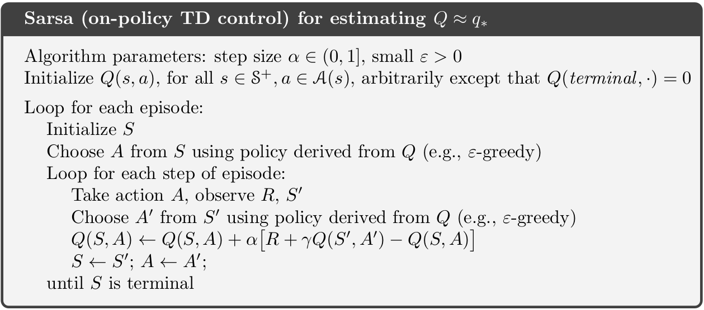
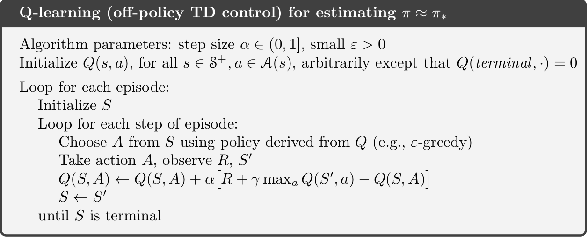

```{r, code = readLines("setup.R"), cache = FALSE, include=FALSE}
```

```{r, child = "_algorithms.Rmd", echo=FALSE}
```

```{r}
knitr::opts_chunk$set(
   echo = TRUE
)
```


# Temporal difference methods for control {#mod-td-control}

In Module \@ref(mod-td-pred) temporal difference (TD) was used to estimate state-values. In this module we focus on improving the policy (control) by applying generalized policy iteration (GPI) using TD methods. GPI repeatedly apply policy evaluation and policy improvement. Since we do not have a model (the transition probability matrix and reward distribution are not known) all our action-values are estimates. Hence an element of exploration are needed to estimate the action-values. For convergence to the optimal policy a model-free GPI algorithm must satisfy:

1. *Infinite exploration*: all state-action $(s,a)$ pairs should be explored infinitely many times as the number of iterations go to infinity (in the limit), i.e. as the number of iterations $k$ goes to infinity the number of visits $n_k$ does too $$\lim_{k\rightarrow\infty} n_k(s, a) = \infty.$$
2. *Greedy in the limit*: while we maintain infinite exploration, we do eventually need to converge to the optimal policy:
  $$\lim_{k\rightarrow\infty} \pi_k(a|s) = 1 \text{ for } a = \arg\max_a q(s, a).$$

## Learning outcomes 

By the end of this module, you are expected to:

* Describe how generalized policy iteration (GPI) can be used with TD to find improved policies.
* Identify the properties that must the satisfied for GPI to converge to the optimal policy.
* Derive and explain SARSA an on-policy GPI algorithm using TD.
* Describe the relationship between SARSA and the Bellman equations.
* Derive and explain Q-learning an off-policy GPI algorithm using TD.
* Argue how Q-learning can be off-policy without using importance sampling.
* Describe the relationship between Q-learning and the Bellman optimality equations.
* Derive and explain expected SARSA an on/off-policy GPI algorithm using TD.
* Describe the relationship between expected SARSA and the Bellman equations.
*  Explain how expected SARSA generalizes Q-learning.
* List the differences between Q-learning, SARSA and expected SARSA.
* Apply the algorithms to an MDP to find the optimal policy.

The learning outcomes relate to the [overall learning goals](#mod-lg-course) number 3, 4, 6, 9, and 12 of the course.

<!-- SOLO increasing: identify · memorise · name · do simple procedure · collect data · -->
<!-- enumerate · describe · interpret · formulate · list · paraphrase · combine · do -->
<!-- algorithms · compare · contrast · explain causes · analyse · relate · derive · -->
<!-- evaluate · apply · argue · theorise · generalise · hypothesise · solve · reflect -->


## Textbook readings

For this week, you will need to read Chapter 6.4-6.6 in @Sutton18. Read it before continuing this module. A summary of the book notation can be seen [here][sutton-notation].

```{r, echo=FALSE}
link_slide_file_text("08", "td-control")
```

## SARSA - On-policy GPI using TD

The first GPI algorithm we will consider is SARSA. Since we do not have a model we need to estimate action-values so the optimal policy can be found using $q_*$ (see Eq. \@ref(eq:bell-opt-state-policy)). Hence to predict action-values for a policy $\pi$, the incremental update Eq. \@ref(eq:td0) must be modified to use $Q$ values: 
$$
Q(S_t, A_t) \leftarrow Q(S_t, A_t) + \alpha \left[R_{t+1} + \gamma Q(S_{t+1}, A_{t+1}) - Q(S_t, A_t) \right]
$$
Note given a policy $\pi$ you need to know $S_t, A_t, R_{t+1}, S_{t+1}, A_{t+1}$ or short SARSA before you can make an update. This acronym is used to name the algorithm.

The algorithm is given in Figure \@ref(fig:td-sarsa-alg). To ensure infinite exploration of all action-values, we need e.g. an $\epsilon$-greedy policy. The algorithm can also be applied for processes with continuing tasks. To ensure greedy in the limit a decreasing epsilon can be used (e.g. $\epsilon = 1/t$). No stopping criterion is given but could stop when small differences in action-values are observed. 

```{r td-sarsa-alg, echo=FALSE, fig.cap="SARSA - On-policy GPI using TD [@Sutton18]."}

```

SARSA is a sample based algorithm that do updates based on the Bellman equation for action-values ($q$):
$$
\begin{align}
  q_\pi(s, a) &= \mathbb{E}_\pi[G_t | S_t = s, A_t = a] \\
  &= \mathbb{E}_\pi[R_{t+1} + \gamma G_{t+1} | S_t = s, A_t = a] \\
  &= \sum_{s',r} p(s', r | s, a) \left(r + \gamma v_\pi(s')\right) \\
  &= \sum_{s',r} p(s', r | s, a) \left(r + \gamma \sum_{a'} \pi(a'|s) q_\pi(s', a')\right).
\end{align}
$$
That is, we update the estimate based on samples $r$ and the estimate $q_\pi$ in $s'$. This is the same approach as policy iteration in DP: we first calculate new estimates of $q_\pi$ given the current policy $\pi$ and then improve. Hence SARSA is a sample based version of policy iteration in DP.


## Q-learning - Off-policy GPI using TD

Q-learning resembles SARSA; however there are some differences. The algorithm is given in Figure \@ref(fig:td-q-learning-alg). Note the incremental update equation is now: 
\begin{equation}
Q(S_t, A_t) \leftarrow Q(S_t, A_t) + \alpha \left[R_{t+1} + \gamma \max_{a} Q(S_{t+1}, a) - Q(S_t, A_t) \right]
\end{equation}
That is, the next action used to update $Q$ is selected greedy. That is, we are no longer following an $\epsilon$-greedy policy for our updates. 

```{r td-q-learning-alg, echo=FALSE, fig.cap="Q-learning - Off-policy GPI using TD [@Sutton18]."}

```

SARSA is an on-policy algorithm, meaning that the behavioural and target policy is the same, e.g. an $\epsilon$-greedy policy to ensure exploration. That is, for fixed $\epsilon$ the greedy in the limit assumption is not fulfilled. Q-learning, on the other hand, is an off-policy algorithm where the behavioural policy is an $\epsilon$-greedy and the target policy is the (deterministic) greedy policy. That is, Q-learning fulfil both the 'infinite exploration' and 'greedy in the limit' assumptions. 

Note under MC prediction an off-policy algorithm needed to use importance sampling to estimate the action-value of the target policy (see Section \@ref(sec-mc-off-policy)). This is not necessary for one-step TD, since 
$$
\begin{align}
q_\pi(s,a) &= \mathbb{E}_{\pi}[R_t + \gamma G_{t+1}|S_t = s, A_t = a] \\
           &= \sum_{s',r} p(s', r | s, a) \left(r + \gamma \sum_{a'} \pi(a'|s) q_\pi(s', a')\right) \\
           &= \sum_{s',r} p(s', r | s, a) \left(r + \gamma \max_{a'} q_\pi(s', a')\right) \\
\end{align}
(\#eq:bellman-q)
$$ 

That is, because the target policy is greedy and deterministic expectation the $G_{t+1}$ becomes a maximum. Hence we can update the action-value estimates $Q$ for the target policy $\pi$ even though we sample from an $\epsilon$-greedy behavioural policy.

Q-learning is a sample based algorithm that do updates based on the Bellman optimality equation for action-values ($q_*$):
$$
\begin{align}
  q_*(s, a) &= \max_\pi q_\pi(s, a) \\
  &= \max_\pi \sum_{s',r} p(s', r | s, a) \left(r + \gamma v_\pi(s')\right) \\
  &= \sum_{s',r} p(s', r | s, a) \left(r + \gamma \max_\pi v_\pi(s')\right) \\
  &= \sum_{s',r} p(s', r | s, a) \left(r + \gamma \max_{a'} q_*(s', a')\right) 
\end{align}
$$
That is, we update the estimate based on samples $r$ and the estimate $q_*$ in $s'$. This is the same approach as value iteration in DP: we update the estimates of $q_\pi$ and improve the policy in one operation. Hence Q-learning is a sample based version of value iteration in DP.


## Expected SARSA - GPI using TD

The expected SARSA, as SARSA, focus on the Bellman equation \@ref(eq:bellman-q). SARSA generate action $A_{t+1}$ from the policy $\pi$ and use the estimated action-value of $(S_{t+1},A_{t+1})$. However, since we know the current policy $\pi$, we might update based on the expected value instead:
$$
Q(S_t, A_t) \leftarrow Q(S_t, A_t) + \alpha \left[R_{t+1} + \gamma \sum_{a} \pi(a | S_{t+1}) Q(S_{t+1}, a) - Q(S_t, A_t) \right] \\
$$
That is, we use a better estimate of the Bellman equation \@ref(eq:bellman-q) by not sampling $A_{t+1}$ but using the (deterministic) expectation over all actions instead. Doing so reduces the variance induced by selecting random actions according to an $\epsilon$-greedy policy. As a result, given the same amount of experiences, expected SARSA generally performs better than SARSA, but has a higher computational cost.

Expected SARSA is more robust to different step-size values. The incremental update formula can be written as
$$
Q(S_t, A_t) \leftarrow Q(S_t, A_t) + \alpha \left[T_t - Q(S_t, A_t) \right] = (1-\alpha)Q(S_t, A_t) + \alpha T_t,
$$
with step-size $\alpha$ and target $T_t$. For SARSA the target is
$$T_t = R_{t+1} + \gamma Q(S_{t+1}, A_{t+1}),$$
and for expected SARSA the target is: $$T_t = R_{t+1} + \gamma \sum_{a} \pi(a | S_{t+1}) Q(S_{t+1}, a).$$ Now assume that we have run the algorithm over many time-steps so that our estimates $Q(S_t, A_t)$ are close to $q_*(S_t, A_t)$. Since the target in expected SARSA is deterministic (we do not sample $A_{t+1}$), the target $T_t \approx Q(S_t, A_t)$ and no matter the step-size $Q(S_t, A_t)$ will be updated to the same value. On the other hand, the target in SARSA uses a sample action $A_{t+1}$ that might have an action-value far from the expectation. This implies that for large step-sizes $Q(S_t, A_t)$ will be updated to the target which is wrong. Hence SARSA is more sensitive to large step-sizes.

Expected SARSA can be both on-policy and off-policy. If the behavioural policy and the target policy are different it is off-policy. If they are the same it is on-policy. For instance, expected SARSA is off-policy if the target policy is greedy and the behavioural policy $\epsilon$-greedy. In which case expected SARSA becomes Q-learning since the expectation of a greedy policy is the maximum value ($\pi(s|a) = 1$ here). Hence expected SARSA can be seen as a generalisation of Q-learning that improves SARSA.


## Summary 

Read Chapter 6.9 in @Sutton18.


## Exercises


### Exercise - Factory Storage {#ex-td-control-storage}

Consider Example \@ref(exe-dp-storage) where a factory has a storage tank with a capacity of 4 $\mathrm{m}^{3}$ for temporarily storing waste produced by the factory. Each week the factory produces $0,1$, 2 or 3 $\mathrm{m}^{3}$ waste with respective probabilities 
$$p_{0}=\displaystyle \frac{1}{8},\ p_{1}=\displaystyle \frac{1}{2},\ p_{2}=\displaystyle \frac{1}{4} \text{ and } p_{3}=\displaystyle \frac{1}{8}.$$ 
If the amount of waste produced in one week exceeds the remaining capacity of the tank, the excess is specially removed at a cost of $30 per cubic metre. At the end of each week there is a regular opportunity to remove all waste from the storage tank at a fixed cost of $25 and a variable cost of $5 per cubic metre. 

An MDP model was formulated in Example \@ref(exe-dp-storage) and solved using policy iteration. Our goal here is to solve the same problem with GPI using TD. For this we need an environment representing the problem:

```{r}
library(R6)
library(hash)
library(tidyverse)

#' R6 Class representing the RL environment for the problem
RLEnvFactory <- R6Class("RLEnvFactory",
   public = list(

      #' @field pr Probability of 0, 1, 2, and 3 m2 waste
      pr = c(1/8, 1/2, 1/4, 1/8),
      
      #' @description Return all states (keys).
      getStates = function() {
         return(str_c(0:4))
      },
      
      #' @description Return all actions (keys) for a state.
      #' @param s State considered.
      getActions = function(s) {
         if (s == "0") return("keep")
         return(c("empty", "keep"))
      },
      
      #' @description Returns the next state and reward given current state and action as a list (with names `r` and `sN`).
      #' @param s Current state.
      #' @param a Current action.
      getTimeStepData = function(s, a) {
         s <- as.numeric(s)
         if (a == "empty") {
            return(list(r = -(25 + 5*s), sN = as.character(sample(0:3, 1, prob = self$pr))))
         }
         if (a == "keep") {
            sN <- s + sample(0:3, 1, prob = self$pr)
            rew <- 0
            if (sN > 4) {
               rew <- -30 * (sN - 4)
               sN <- 4
            }
            return(list(r = rew, sN = as.character(sN)))
         }
         stop("Error finding next state and reward!")
      }
   )
)
```

Note that for using the GPI algorithms in the agent class we need a method `getTimeStepData` that given a state and action return the reward and the next state. 

<!-- Q1 -->


1) Consider the `getTimeStepData` method and explain what it does. Generate a reward and next state for $(s,a)$ pairs (0, keep), (4, keep) and (2, empty).

Next we have to add the GPI algorithms to the generic agent class:

```{r ref.label='RLAgent', eval=TRUE}
```


<!-- Q2 -->


2) Consider the algorithms `gpiOnPolicySARSA`, `gpiOffPolicyQLearning` and `gpiOnPolicyExpSARSA` and try to identify the differences compared to the pseudo code descriptions. Why is expected SARSA here an on-policy algorithm?

In the following let us try to approximate the optimal policy using a discount factor of 0.5. The state-values for the optimal deterministic policy can be seen in Example \@ref(exe-dp-storage).

We define the RL agent:

```{r}
agent <- RLAgent$new()
agent$addStates(env$getStates())   # add states
for (s in agent$getStateKeys()) {  # add actions
   agent$addActions(s, env$getActions(s))
} 
agent$getActionInfo("0")
agent$getActionInfo("4")
```


<!-- Q3 -->


3) Run the algorithms `gpiOnPolicySARSA`, `gpiOffPolicyQLearning` and `gpiOnPolicyExpSARSA` using `maxEL = 5`, `alpha = 0.1` and `verbose = T` and explain the output:

```{r}
agent$gpiOnPolicySARSA(env, maxEL = 5, verbose = T, gamma = 0.5)
agent$getActionValues()
agent$getPolicy()

agent$gpiOffPolicyQLearning(env, maxEL = 5, verbose = T, gamma = 0.5)
agent$getActionValues()
agent$getPolicy()

agent$gpiOnPolicyExpSARSA(env, maxEL = 5, verbose = T, gamma = 0.5)
agent$getActionValues()
agent$getPolicy()
```


<!-- Q4 -->
<!-- First solv MDP -->
```{r ref.label='MDP-class', include=FALSE}
``` 

```{r, include=FALSE}
#' Expected reward of an action
#' @param s Waste amount (state).
#' @param a Action (keep or empty).
#' @return The expected reward
reward <-function(s, a) {
   i <- as.numeric(s)
   p<-c(1/8, 1/2, 1/4, 1/8)
   if (a=="keep") {
      if (i<2) return(0)   # no excess waste
      k <- (4-i+1):3
      return(-30*sum( (i+k-4)*p[k+1] ) )
   }
   if (a=="empty") {
      return(-1*(25 + 5*i))
   }
   return(NULL)
}

#' Find transition probabilities
#' @param s Waste amount (state).
#' @param a Action (keep or empty).
#' @return The trans pr and id 
transPr<-function(s, a) {
   i <- as.numeric(s)
   p<-c(1/8, 1/2, 1/4, 1/8)
   pr<-NULL
   id<-NULL
   if (a=="keep") {
      if (i<4) for (j in i:3) {
         pr<-c(pr,p[j-i+1])
         id<-c(id,j)
      }
      if (i>0) {
         pr<-c(pr,sum(p[(4-i):3+1]))
         id<-c(id,4)
      }
   }
   if (a=="empty") {
      for (j in 0:3) {
         pr<-c(pr,p[j+1])
         id<-c(id,j)
      }
   }
   names(pr) <- id
   return(pr)
}

mdp <- MDPClass$new()
mdp$addStateSpace(0:4)   # add state keys
for (s in mdp$getStateKeys()) mdp$addActionSpace(s, c("empty", "keep"))  # add action keys
# Add trans pr and rewards
for (s in mdp$getStateKeys()) {
   for (a in mdp$getActionKeys(s)) {
      mdp$addAction(s, a, r = reward(s,a), pr = transPr(s,a))
   }
}

mdp$policyIte(gamma = 0.5)
res <- left_join(mdp$getStateValues(), mdp$getPolicy())

mdp$policyIte(gamma = 0.99)
res1 <- left_join(mdp$getStateValues(), mdp$getPolicy())
```


4) Run the algorithms `gpiOnPolicySARSA`, `gpiOffPolicyQLearning` and `gpiOnPolicyExpSARSA` using `maxEL = 5000` and `alpha = 0.1`. Compare the policy and action-values against the state-values for the optimal deterministic policy found in Example \@ref(exe-dp-storage): 

```{r, echo=FALSE}
res
```


<!-- Q5 -->


5) Run the algorithm `gpiOffPolicyQLearning` using `gamma = 0.99`, `maxEL = 5000, 10000 and 20000`. Compare the policy and action-values against the state-values for the optimal deterministic policy found in Example \@ref(exe-dp-storage): 

```{r, echo=FALSE}
res1
```


<!-- Q6 -->


6) How will the alpha value affect the rate of convergence?


### Exercise - Car Rental {#ex-td-control-car}

Consider the car rental problem in Exercise \@ref(ex-mdp-2-car) and \@ref(ex-dp-rental). An MDP model was formulated in Exercise \@ref(ex-dp-rental) and solved using policy iteration. Our goal here is to solve the same problem with GPI using TD. 


<!-- MDP model -->
```{r, include=FALSE, cache=TRUE}
library(tidyverse)

# Mean of min(D,z). Assume z >= 0
meanMinD <- function(z, lambda) {
   if (z == 0) return(0)
   sum(dpois(0:(z-1), lambda) * 0:(z-1)) + ppois(z-1, lambda, lower.tail = F) * z
}

reward <- function(x, y, a) {
   10 * meanMinD(x-a, 3) + 10 * meanMinD(y+a, 4) - 2 * abs(a)
}

lD <- c(3,4)
lH <- c(3,2)

# Pr(min(D_i, k) = d)
# assume that d<=k
prMin <- function(i, k, d) {
   if (k == 0) return(1)
   v <- c(dpois(0:(k-1), lD[i]), ppois(k-1, lD[i], lower.tail = F))
   return(v[d+1])
   # if (d == k) return(1 - pD[i, d])     # 1-pr(D <= d-1)
   # if (d < k) return(dD[i, d+1])
   # return(NA)
}

# Pr(xN | x, a)
transPrX <- function(xN, xBar) {
   if (xN == 20) {
      return(sum(prMin(1, xBar, 0:(xBar)) * ppois(xN - xBar + 0:(xBar) - 1, lH[1], lower.tail = F)))
   }
   if (xN < 20) {
      return(sum(prMin(1, xBar, 0:(xBar)) * dpois(xN - xBar + 0:(xBar), lH[1])))
   }
   error("Error in calculations!")
}

# Pr(yN | y, a)
transPrY <- function(yN, yBar) {
   if (yN == 20) {
      return(sum(prMin(2, yBar, 0:(yBar)) * ppois(yN - yBar + 0:(yBar) - 1, lH[2], lower.tail = F)))
   }
   if (yN < 20) {
      return(sum(prMin(2, yBar, 0:(yBar)) * dpois(yN - yBar + 0:(yBar), lH[2])))
   }
   error("Error in calculations!")
}

mat <- matrix(0, nrow = 21, ncol = 21)
colnames(mat) <- str_c(0:20)
rownames(mat) <- str_c(0:20)
matTransPrX <- mat     # matTransPrX[r,c] = Pr(xN = c-1 | xBar = r-1)
matTransPrY <- mat
for (r in 1:21) {
   xBar <- r-1
   for (c in 1:21) {
      xN <- c-1
      matTransPrX[r,c] <- transPrX(xN, xBar)
      matTransPrY[r,c] <- transPrY(xN, xBar)
   }
}


mdp <- MDPClass$new()      # initialize mdp object
states <- expand_grid(x = 0:20, y = 0:20) %>% 
   mutate (state = str_c(x,",",y)) %>% 
   pull(state)
mdp$addStateSpace(states)   # add states (states are keys in a hash and are always converted to strings)
for (s in mdp$getStateKeys()) {  # add actions for each state (only the key of the action)
    x <- str_split(s, ",", simplify = T)
    y <- as.numeric(x[2])
    x <- as.numeric(x[1])
    a <- (-min(5, y, 20-x)):(min(5, x, 20-y))
    mdp$addActionSpace(s, a)
}

# Add trans pr and expected reward to the actions. This may take some time!!
states <- expand_grid(x = 0:20, y = 0:20) %>% 
   mutate (state = str_c(x,",",y), pr = 0) 
for (s in mdp$getStateKeys()) {
   for (aS in mdp$getActionKeys(s)) {
      x <- str_split(s, ",", simplify = T)
      y <- as.numeric(x[2])
      x <- as.numeric(x[1])
      a <- as.numeric(aS) 
      xBar <- x-a
      yBar <- y+a
      for (i in 1:nrow(states)) {
         states$pr[i] <- matTransPrX[xBar+1, states$x[i] + 1] * matTransPrX[yBar+1, states$y[i] + 1]
      }
      transPr <- states$pr
      names(transPr) <- states$state
      mdp$addAction(s, aS, r = reward(x, y, a), pr = transPr)
   }
}


mdp$policyIte(gamma = 0.5, theta = 0.9)
dfMDP05 <- left_join(mdp$getStateValues(), mdp$getPolicy(), by = "state") %>% 
   select(-pr) %>% 
   separate(state, into = c("x", "y"), sep = ",", remove = F, convert = T) %>% 
   mutate(a = as.numeric(action))

mdp$policyIte(gamma = 0.9, theta = 0.9)
dfMDP09 <- left_join(mdp$getStateValues(), mdp$getPolicy(), by = "state") %>% 
   select(-pr) %>% 
   separate(state, into = c("x", "y"), sep = ",", remove = F, convert = T) %>% 
   mutate(a = as.numeric(action))
```


<!-- Q1 -->


1) Code an environment representing the problem and test your `getTimeStepData` method.


<!-- Q2 -->


2) Run the algorithms `gpiOnPolicySARSA`, `gpiOffPolicyQLearning` and `gpiOnPolicyExpSARSA` using a few iterations with a discount rate $\gamma = 0.5$, `verbose = T` and explain the output.


<!-- Q3 -->


3) Run the algorithms `gpiOnPolicySARSA`, `gpiOffPolicyQLearning` and `gpiOnPolicyExpSARSA` with a discount rate $\gamma = 0.5$ using a high number of iterations, e.g. 25000, 50000 and 100000. Compare the policy with the optimal deterministic policy found in Exercise \@ref(ex-dp-rental), e.g. make a plot of the optimal policy with $x$ on the y-axis and $y$ on the x-axis, plotting the action:

```{r}
ggplot(dfMDP05, aes(x = y, y = x, col = factor(a))) +
      geom_point() +
      scale_fill_brewer(palette = "Set2") + 
      labs(title = str_c("Optimal MDP policy")) 
```


<!-- Q4 -->


4) Consider Q-learning with 100000 iterations. What is the optimal action in state $(5,5)$? What is the state-value in state $(5,5)$ and $(15,18)$ and its interpretation? 


<!-- Q5 -->


5) Run the algorithm `gpiOffPolicyQLearning` with a discount rate $\gamma = 0.5$ using a high number of iterations, e.g. 25000, 50000 and 100000. However set the start actions-values equal to the optimal state-value in a state found by the MDP. Compare the policy with the policies found in Question 3. 


<!-- Q6 -->


6) Run the algorithm `gpiOffPolicyQLearning` with a discount rate $\gamma = 0.5$ and 100000 iterations. Test the effect of different epsilon-greedy behaviour policies, e.g. epsilon = 0.2, 0.5 and 1.


<!-- Q7 -->


7) Run the algorithm `gpiOffPolicyQLearning` with a discount rate $\gamma = 0.5$ and 100000 iterations. Test the effect of different step-sizes, e.g. alpha = 0.05, 0.2, 0.5.


```{r links, child="links.md", include=FALSE}
```

```{r, include=FALSE}
knitr::knit_exit()
```


